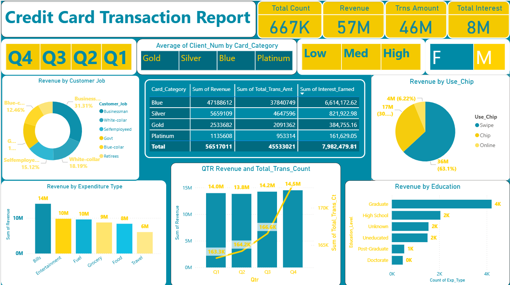
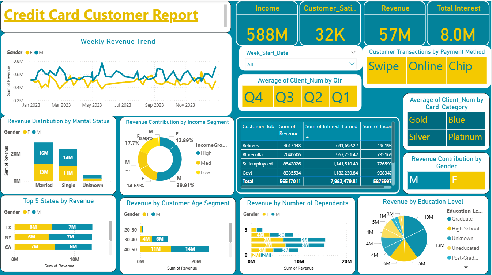

# Credit-Card-Financial-Analytics-PowerBI
# Credit Card Financial Analytics Dashboard

## Dashboard Preview

Credit Card Transaction Analytics Dashboard

Credit Card Customer Insights Dashboard

---

## Project Overview

The Credit Card Financial Analytics Dashboard is an interactive data analytics solution built using Power BI to analyze credit card transactions and customer financial behavior.

This project provides a comprehensive view of transaction activity, revenue generation, customer demographics, spending behavior, and financial performance metrics.

By transforming raw financial data into meaningful visual insights, the dashboard helps financial institutions understand customer spending patterns, revenue distribution, and transaction trends.

The dashboards enable data-driven decision making for banking and financial organizations by identifying high value customers, analyzing payment methods, and evaluating revenue contributions across multiple customer segments.

---

## Business Problem

Financial institutions generate massive volumes of credit card transaction data every day. However, without effective analytics tools, it becomes difficult to extract meaningful insights from this data.

Banks and financial organizations need to understand:

Customer spending behavior  
Revenue contribution by customer segments  
Payment method usage patterns  
Transaction trends across time periods  
Revenue distribution by demographics and income groups

Without proper analysis, organizations may miss opportunities to optimize financial products, improve customer targeting strategies, and increase revenue.

This dashboard addresses these challenges by providing a centralized analytics platform that enables stakeholders to monitor financial performance and customer behavior through interactive visualizations.

---

## Key Performance Indicators

Total Transaction Count  
Represents the total number of credit card transactions processed.

Total Revenue  
Shows the overall revenue generated from credit card transactions.

Total Transaction Amount  
Displays the total monetary value of all credit card transactions.

Total Interest Earned  
Represents the interest revenue generated from credit card usage.

Customer Satisfaction Score  
Measures customer satisfaction related to credit card services.

Total Customer Income  
Shows the aggregated income of credit card customers.

---

## Dashboard 1: Credit Card Transaction Analytics

This dashboard focuses on transaction level insights and financial performance.

Revenue by Customer Job  
Analyzes revenue contribution based on customer occupation categories.

Salary Distribution Across Card Categories  
Shows how credit card usage varies across card types such as Blue, Silver, Gold, and Platinum.

Revenue by Chip Usage  
Displays transaction revenue based on payment methods including swipe, chip, and online transactions.

Revenue by Expenditure Type  
Analyzes spending patterns across categories such as bills, entertainment, fuel, groceries, food, and travel.

Quarterly Revenue and Transaction Trends  
Shows how revenue and transaction counts change across different quarters.

Revenue by Education Level  
Displays revenue contribution based on customer education levels.

---

## Dashboard 2: Credit Card Customer Insights

This dashboard focuses on customer behavior and demographic insights.

Weekly Revenue Trends  
Analyzes how revenue changes over time across different weeks.

Revenue Distribution by Marital Status  
Shows how revenue varies between married, single, and other customer segments.

Revenue Contribution by Income Segment  
Analyzes revenue distribution across different income groups.

Top States by Revenue  
Identifies the states generating the highest revenue from credit card transactions.

Revenue by Customer Age Segment  
Analyzes spending patterns across age groups.

Revenue by Number of Dependents  
Shows how household size impacts credit card spending.

Revenue by Education Level  
Displays revenue contribution across different educational backgrounds.

---

## Tools and Technologies Used

Power BI  
Data Modeling  
DAX Calculations  
Data Visualization

---

## Skills Demonstrated

Financial data analysis  
Customer segmentation analysis  
Interactive dashboard development  
Business intelligence reporting  
Data visualization and storytelling

---

## Key Insights

Revenue is strongly influenced by specific customer occupations and income segments.

Certain payment methods generate significantly higher transaction volumes.

Customer demographics such as age group, marital status, and education level influence spending patterns.

Quarterly revenue trends highlight seasonal variations in transaction activity.

These insights help financial organizations improve credit card strategies and customer targeting.

---

## Future Improvements

Integrate real time transaction data pipelines.

Implement predictive models for customer spending behavior.

Develop fraud detection analytics dashboards.

Enhance segmentation models for personalized financial product recommendations.

---

## Author

Atharva Gudur  
Data Analyst | Power BI | SQL | Data Visualization
